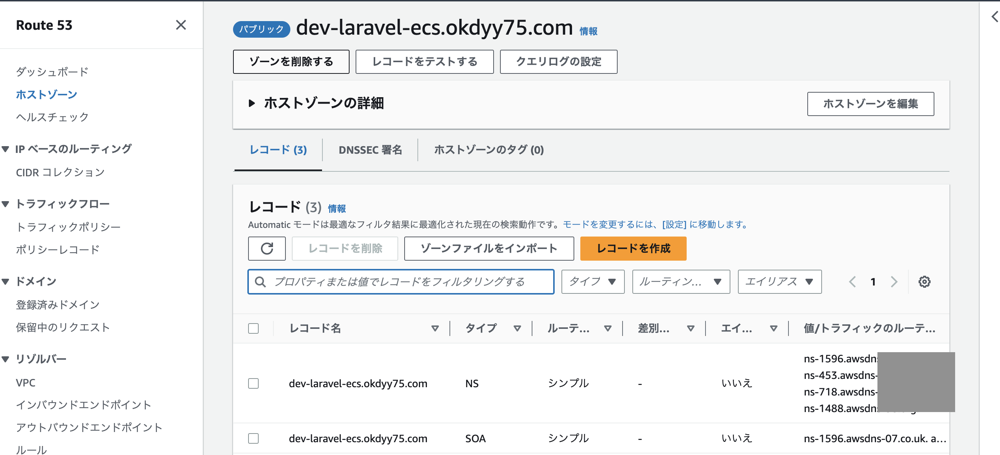
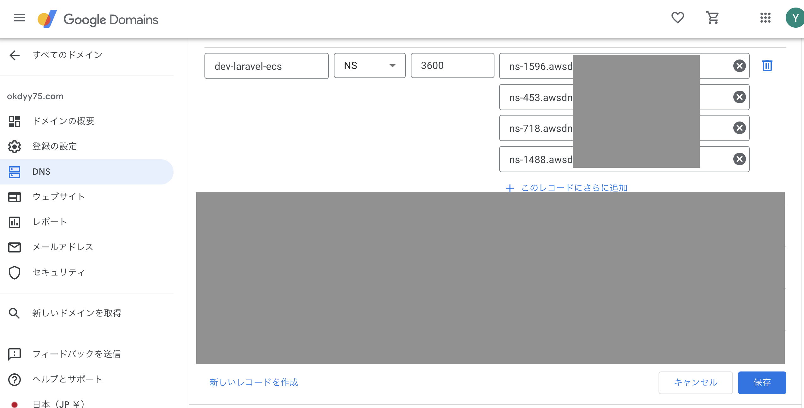

# TerraformとGitHub ActionsでECSからLaravelを動かそう
構成としては、あまり変更が少ないインフラ周りはterraformで管理し、頻繁に変更されるソースやタスク定義はGitHub Actionsから管理する構成になっています。環境ごとにディレクトリも分けて、実運用を考えた構成にしてみました。



## ディレクトリ構成

```
.
├── docker                   ...ローカル開発用Docker
├── docker-compose.yml       ...ローカル開発用Docker Compose
├── docker-compose.yml.dev   ...ECR用Dockerfileのビルド参考用Docker Compose
├── ecs                      ...ecs関連（ECR・タスク定義）
│   └── dev
│       ├── container        ...ECR用Dockerfile
│       └── task_definition  ...タスク定義ファイル
├── system.drawio            ...システム構成図
├── terraform           ...terraform関連（インフラ周り）
│   ├── environments
│   │   └── dev         ...dev環境向けterraform
│   ├── example.tfvars  ...環境変数ファイル
│   └── modules
│       ├── ecs          ...ecs関連の構成
│       └── rds          ...rds関連の構成
└── web
    └── laravel          ... Laravel本体
```

## 事前設定
### Terraform設定
[Terraform設定](terraform/README.md)

### ECSタスク定義作成
ECS本体の設定はterraform側で管理するが、ECR・タスク定義はGitHub Actionsから管理するので、ロール名やロググループのパスはterraformとタスク定義jsonで事前に揃えておく

- family（例：`y-oka-ecs-dev`）
- taskRoleArn（例：`y-oka-ecs-task-execution`）
- logConfigurationのawslogs-group（例：`/y-oka-ecs/ecs`）
- secretsのvalueFrom（例：`/y-oka-ecs/dev/APP_KEY`）
を揃える

ecs/dev/task_definition/y-oka-ecs.json

```
  "family": "y-oka-ecs-dev",
  "taskRoleArn": "arn:aws:iam::<awsのアカウントID>:role/y-oka-ecs-dev-task-execution",
  "executionRoleArn": "arn:aws:iam::<awsのアカウントID>:role/y-oka-ecs-dev-task-execution",
  ...
      "secrets": [
        {
          "name": "APP_KEY",
          "valueFrom": "/y-oka-ecs/dev/APP_KEY"
        },
  ...

      "logConfiguration": {
        "logDriver": "awslogs",
        "options": {
          "awslogs-region": "ap-northeast-1",
          "awslogs-group": "/y-oka-ecs/ecs",
          "awslogs-stream-prefix": "dev"
        }
      }
```

clusterとserviceはterraformでまだ作成されていないのでコメントアウト
```yml
      - name: Deploy to ECS TaskDefinition
        uses: aws-actions/amazon-ecs-deploy-task-definition@v1
        with:
          task-definition: ${{ steps.render-nginx-container.outputs.task-definition }}
          # cluster: ${{ env.ECS_CLUSTER }}
          # service: ${{ env.ECS_SERVICE }}

```

#### GitHub Actionsからタスク定義作成CIを実行

CIを実行する前にGitHub ActionsのSecretsを設定しておく。Secretsを設定したらプッシュしてECSデプロイCIを実行

```bash
git push origin develop
```

### ドメイン設定
今回はhttps接続できるようにドメインも設定しておく。  
自分は「okdyy75.com」というドメインをGoogleドメインに持っているので、新しく「dev-laravel-ecs.okdyy75.com」というドメインをRoute53からレコード作成して証明書を設定していく

#### Route53からドメイン作成
Route53から「dev-laravel-ecs.okdyy75.com」というドメイン名でホストゾーンを作成

ホストゾーンを作成するとNSレコードとSOAレコードが作成されるので



そのNSレコードのネームサーバーをGoogleドメインに登録



#### 作成したドメインの証明書作成
AWS Certificate Manager (ACM)から「dev-laravel-ecs.okdyy75.com」のドメインの証明書をリクエスト
作成後、証明書の詳細画面から「Route53でレコード作成」を実行（画像の証明書は削除済みです）


以上で下準備は完了です!!

------------------------------

## 開発の流れ
1. developブランチからトピックブランチを切る
  - インフラを更新したい場合は`terraform/`以下のディレクトリを修正したブランチを切る
  - タスク定義・ソースを更新したい場合は`ecs/`、`web/`以下のディレクトリを修正したブランチを切る
2. terraform周りの修正したブランチはマージする前に一度GitHub ActionsからTerraformプランCI（`terraform_plan_dev.yml`）を手動実行して確認する。
3. トピックブランチをdevelopブランチにマージする。マージされると各GitHub Actionsが動作する
  - `terraform/`以下のディレクトリを修正した場合はterrform applyが実行される
  - `ecs/`、`web/`以下のディレクトリを修正した場合はタスク定義が更新され、新しいタスクがデプロイされる
4. リリース後artisanコマンドを実行したい場合はGitHub ActionsのECS Exec command CI（`ecs_exec_cmd_dev.yml`）を実行する
  - たとえばSeederを実行したい場合は`"php","/var/www/web/laravel/artisan","db:seed","--class=UserSeeder","--force"`のように実行する

## Terraform解説
[Terraform解説](./terraform_readme.md)

## GitHub Actions CI解説
[GitHub Actions CI解説](./github_actions_readme.md)

## ECS Execで直接コンテナに入ってデバッグする方法
[ECS Execを使って直接コンテナに入ってデバッグ](./ecs_exec_debug.md)

### 参考にさせて頂いたサイト
- [Terraformで構築するAWS](https://y-ohgi.com/introduction-terraform/laravel/about/)
- [ECS(Fargate)でnextjs+laravel+rds環境構築](https://zenn.dev/nicopin/books/58c922f51ea349)
